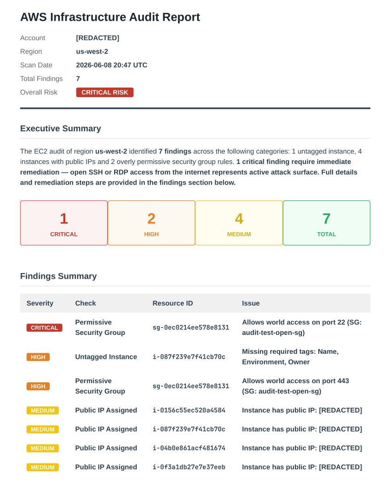

# AWS Audit MCP Server

An MCP server that audits your AWS EC2 infrastructure for compliance and security issues, and generates professional client-ready reports in Markdown, HTML, or PDF.



## Quick Start

### Build and Run

```bash
docker build -t aws-audit-mcp .
docker run -p 5000:5000 aws-audit-mcp
```

### Usage with Claude

**Step 1 — Run the audit:**

Call the `audit_ec2` tool with your AWS credentials:

```json
{
  "access_key_id": "YOUR_KEY",
  "secret_access_key": "YOUR_SECRET",
  "region": "us-east-1"
}
```

**Step 2 — Generate a report:**

Pass the JSON output from `audit_ec2` directly into `generate_report`:

```json
{
  "audit_json": "<output from audit_ec2>",
  "format": "pdf",
  "region": "us-east-1",
  "account_id": "123456789012"
}
```

Supported formats: `markdown`, `html`, `pdf`

For PDF output, decode the base64 response and write to disk:

```python
import base64, json

result = json.loads(generate_report_output)
open("aws-audit-report.pdf", "wb").write(base64.b64decode(result["data"]))
```

## Audit Checks (EC2)

- Untagged instances (missing Name, Environment, Owner)
- Public IP assignments
- Overly permissive security groups (0.0.0.0/0 access)

## Report Features

- Executive summary with overall risk rating
- Color-coded severity tiles (Critical / High / Medium / Total)
- Full findings table with resource IDs and remediation recommendations
- Branded footer — customizable for your business
- Three output formats: Markdown, HTML, PDF

## Future Expansions

- RDS audit
- S3 audit
- Cost anomaly detection
- Cross-account role assumption
- Lambda function deployment
